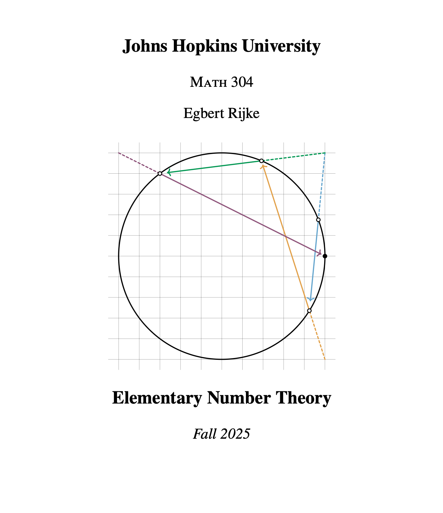

### Johns Hopkins University

- _Introduction to Abstract Algebra._ Spring 2026 [\[Course page\]](jhu-algebra-spring-2026.md)
- _Elementary Number Theory._ Fall 2025 [\[Course page\]](jhu-number-theory-fall-2025.md) [\[Course notes (webpage)\]](/notes/number-theory/)
- _Elementary Number Theory._ Spring 2025 [\[Course page\]](jhu-number-theory-spring-2025.md) [\[Course notes (webpage)\]](/notes/number-theory/)
- _Introduction to Proofs._ Fall 2024

### Carnegie Mellon University

- _Introduction to Homotopy Type Theory._ Carnegie Mellon University, 80-518/80-818, Spring 2018. [\[Course Page\]](cmu-intro-to-hott-2018.md) [\[Course notes\]](hott_intro_cmu.pdf)

### Online

- _HoTTEST Summer School 2022._ Online course on homotopy type theory and formalization of mathematics in Agda. July–August 2022. [Summer school website website](https://www.uwo.ca/math/faculty/kapulkin/seminars/hottest_summer_school_2022.html)

  This summer school was organized by [Carlo Angiuli](https://carloangiuli.com), [Dan Christensen](https://jdc.math.uwo.ca), [Martín Hötzel Escardó](https://www.cs.bham.ac.uk/~mhe/), [Chris Kapulkin](https://www.math.uwo.ca/faculty/kapulkin/index.html), [Dan Licata](https://dlicata.wescreates.wesleyan.edu), [Emily Riehl](https://emilyriehl.github.io), and myself to promote diversity within the field of Homotopy Type Theory. With over 2000 participants, it was a huge success.
