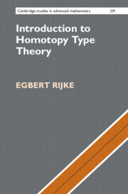

Postdoctoral Researcher  
Department of Mathematics, Johns Hopkins University  
Pronouns: he/him

- [GitHub](https://github.com/EgbertRijke)
- [X](https://x.com/egbertrijke)
- <a rel="me" href="https://mathstodon.xyz/@egbertrijke">mathstodon</a>
- [*n*Lab](https://ncatlab.org/nlab/show/Egbert+Rijke)

Visit the [publisher's webpage](https://www.cambridge.org/us/universitypress/subjects/mathematics/logic-categories-and-sets/introduction-homotopy-type-theory) to order a copy.

## Publications

- B. Ahrens, J. Emmenegger, P. North, and E. Rijke. _Algebraic presentations of type dependency_, Logical Methods in Computer Science, 2025. [arXiv](https://arxiv.org/abs/2111.09948)
- U. Buchholtz, J.D. Christensen, J. Taxerås, E. Rijke. _Central H-spaces and Banded Types_, Journal of Pure and Applied Algebra (2025). [arXiv](https://arxiv.org/abs/2301.02636)
- B. Ahrens, J. Emmenegger, P. North, and E. Rijke. _B-systems and C-systems are equivalent_, Journal of Symbolic Logic (2024).
- D. Christensen and E. Rijke, _Characterizations of Modalities and Lex Modalities_, Journal of Pure and Applied Algebra, 2022. [arXiv](https://arxiv.org/abs/2008.03538)
- F. Cherubini and E. Rijke, _Modal Descent_, Mathematical Structures in Computer Science, 2021. [arXiv](https://arxiv.org/abs/2003.09713)
- U. Buchholtz and E. Rijke, _The Long Exact Sequence of Homotopy n-Groups_, Logical Methods in Computer Science, 2021. [arXiv](https://arxiv.org/abs/1912.08696)
- K. Sojakova, F. van Doorn, E. Rijke. _Sequential Colimits in Homotopy Type Theory_, LICS, 2020.
- D. Christensen, M. Opie, E. Rijke, and L. Scoccola, _Localization in Homotopy Type Theory_, Higher Structures, 2018. [arXiv](https://arxiv.org/abs/1807.04155)
- E. Rijke, M. Shulman, and B. Spitters, _Modalities in Homotopy Type Theory_, Logical Methods in Computer Science, 2018. [arXiv](https://arxiv.org/abs/1706.07526)
- U. Buchholtz, F. van Doorn, and E. Rijke, _Higher Groups in Homotopy Type Theory_, Logic in Computer Science, 2018. [arXiv](https://arxiv.org/abs/1802.04315)
- U. Buchholtz and E. Rijke, _The Real Projective Spaces in Homotopy Type Theory_, Logic in Computer Science, 2017. [arXiv](https://arxiv.org/abs/1704.05770)
- U. Buchholtz and E. Rijke, _The Cayley-Dickson Construction in Homotopy Type Theory_, Higher Structures, 2017. [arXiv](https://arxiv.org/abs/1610.01134)
- E. Rijke and B. Spitters, _Sets in Homotopy Type Theory_, Special Issue of Mathematical Structures in Computer Science, 2014. [arXiv](http://arxiv.org/abs/1305.3835)

## Books

- Egbert Rijke. _Introduction to Homotopy Type Theory_. Cambridge University Press, 2025. [CUP website](https://www.cambridge.org/core/books/introduction-to-homotopy-type-theory/0DD31EC06C80797A50ACE807251E80B6), [arXiv](https://arxiv.org/abs/2212.11082)
- Univalent Foundations Program. _Homotopy Type Theory: Univalent Foundations of Mathematics_. Institute for Advanced Study, 2013. [website](https://homotopytypetheory.org/book/)

## Invited Lecture Series

- Interactions of Proof Assistants and Mathematics, Regensburg, Germany, 2023: _The agda-unimath Library_ (3 lectures)
- Mathematics in Ljubljana Summer School, Ljubljana, Slovenia, 2023: _Formalizing Mathematics_
- Days in Logic, Faro, Portugal, 2022: _Daily Applications of the Univalence Axiom_ (3 lectures)
- Logic and Higher Structures, CIRM, Luminy, France, 2022: _Daily Applications of the Univalence Axiom_ (3 lectures)
- EPIT 2020, France, 2021: _Synthetic Homotopy Theory_ (3 lectures)
- Homotopy Type Theory Summer School, Carnegie Mellon University, Pittsburgh, 2019: _Synthetic Homotopy Theory_ (3 lectures)
- Geometry in Modal Homotopy Type Theory, Carnegie Mellon University, Pittsburgh, 2019: _Reflective Subuniverses and Modalities; Separated Types; Modal Descent_ (3 lectures)

## Invited Talks

- TYPES 2024, Copenhagen, Denmark, 2024: _Concrete Univalent Mathematics_
- Directions and Perspectives in the λ-Calculus, Bologna, Italy, 2024
- Workshop on Homotopy Type Theory/Univalent Foundations, Vienna, Austria, 2023: _Enriched Graphs with Applications to Organic Chemistry and Trees_  
- Univalent Foundations for Daily Applications, Bergen, Norway, 2021: _Univalent Combinatorics_
- HoTTEST Seminar, Online, 2021: _A Higher Encode-Decode Method_

## Teaching

### Johns Hopkins University

- _Elementary Number Theory._ Fall 2025 [\[Course page\]](jhu-number-theory-fall-2025.md) [\[Course notes (webpage)\]](number-theory-notes.md)
- _Elementary Number Theory._ Spring 2025 [\[Course page\]](jhu-number-theory-spring-2025.md) [\[Course notes (webpage)\]](number-theory-notes.md)
- _Introduction to Proofs._ Fall 2024

### Carnegie Mellon University

- _Introduction to Homotopy Type Theory._ Carnegie Mellon University, 80-518/80-818, Spring 2018. [\[Course Page\]](cmu-intro-to-hott-2018.md) [\[Course notes\]](hott_intro_cmu.pdf)

### Online

- _HoTTEST Summer School 2022._ Online course on homotopy type theory and formalization of mathematics in Agda. July–August 2022. [Summer school website website](https://www.uwo.ca/math/faculty/kapulkin/seminars/hottest_summer_school_2022.html)

  This summer school was organized by [Carlo Angiuli](https://carloangiuli.com), [Dan Christensen](https://jdc.math.uwo.ca), [Martín Hötzel Escardó](https://www.cs.bham.ac.uk/~mhe/), [Chris Kapulkin](https://www.math.uwo.ca/faculty/kapulkin/index.html), [Dan Licata](https://dlicata.wescreates.wesleyan.edu), [Emily Riehl](https://emilyriehl.github.io), and myself to promote diversity within the field of Homotopy Type Theory. With over 2000 participants, it was a huge success.

## Advising

- Ivan Kobe. _A Type Theory for Synthetic Categories_. Masters thesis, University of Ljubljana, 2025. Recepient of the Prešeren Award for best masters thesis.
- Mabel Najdovski. _Invertible Maps Are Spheres in the Universe_. Undergraduate thesis, University of Ljubljana, 2024. Recepient of the Prešeren Award for best undergraduate thesis.
- Vojtěch Štěpančík. _Formalization of Homotopy Pushouts in Homotopy Type Theory_. Master thesis, Charles University, Prague 2024. Recepient of the Dean's Award for best masters thesis.
- Maša Žaucer. _Formalization of the Structure Sheaf of a Ring Spectrum_. Undergraduate thesis, University of Ljubljana, 2024
- Victor Blanchi. Internship on formalizing _Dirichlet Species and the Hasse-Weil Zeta Function_ in agda-unimath, ENS Lyon, 2023
- Éléonore Mangel. Internship on formalizing the _Delooping the Sign Homomorphism in Univalent Mathematics_ in agda-unimath, ENS Lyon, 2022

## Bio

I am a postdoctoral researcher in the Department of Mathematics at [Johns Hopkins University](https://mathematics.jhu.edu) in Baltimore, MD. My research focuses on the formalization of mathematics and homotopy type theory. I am the lead developer of the [agda-unimath library](https://unimath.github.io/agda-unimath/), the largest library of formalized mathematics in the Agda proof assistant, and author of the forthcoming book, _Introduction to Homotopy Type Theory_ ([ArXiv](https://arxiv.org/abs/2212.11082)).

I have been part of the Homotopy Type Theory community since its inception. As a member of the Univalent Foundations Program during the special year on univalent mathematics at the Institute for Advanced Study, I co-authored the book _Homotopy Type Theory: Univalent Foundations of Mathematics_. From 2014 to 2018 I did my PhD under [Steve Awodey](https://awodey.github.io) at Carnegie Mellon University. I have held postdoctoral positions at the University of Illinois at Urbana-Champaign with [Dan Grayson](https://math.illinois.edu/directory/profile/drg) and at the University of Ljubljana with [Andrej Bauer](https://www.andrej.com). I am currently working under [Emily Riehl](https://emilyriehl.github.io) at Johns Hopkins University.

## Agda-unimath

The [agda-unimath library](https://unimath.github.io/agda-unimath/) was founded during the _Univalent Foundations for Daily Applications_ meeting organized by [Marc Bezem](https://www.ii.uib.no/~bezem/) and [Bjørn Ian Dundas](https://www4.uib.no/en/find-employees/Bjørn.Ian.Dundas) in Bergen, in November 2021. The formalization for my book _Introduction to Homotopy Type Theory_ had grown substantially., and it contained an up-to-date foundation for univalent mathematics. Therefore I suggested to also formalize the [Symmetry](https://github.com/UniMath/SymmetryBook) book. [Elisabeth Stenholm](https://elisabeth.stenholm.one), [Jonathan Prieto-Cubides](https://jonaprieto.github.io), and [Pierre Cagne](http://www.normalesup.org/~cagne/) joined the cause, and helped transforming the book formalization into a library that could be used effectively for other projects.

It soon became clear that we wanted the library to serve a more general purpose, containing any kind of mathematics from a univalent point of view, and that the best format was that of a formalized wiki. Thus the idea was born to have a one-concept-per-file organization, which to our knowledge was new for formalization, and have each file read like an [*n*Lab page](https://ncatlab.org/nlab/show/HomePage) with additional resources and links included in each page. The agda-unimath project has since grown to a project with over 400K lines of code, over 2000 pages, and over 40 contribibutors. It is the largest library of formalized mathematics of any kind in the Agda proof assistant, including the widely used [standard library](https://github.com/agda/agda-stdlib) and the [cubical agda library](https://github.com/agda/cubical). I remain one of the most active contributors to the library, with over 1200 commits and 800K modifications.

However, far more important is the community that we have been growing. At the start of the agda-unimath project we also created the [Univalent Agda Discord server](https://discord.gg/Zp2e8hYsuX), which hosts discussion forums for all Agda libraries, including the [1Lab](https://1lab.dev), the [cubical agda library](https://github.com/agda/cubical), [TypeTopology](https://github.com/martinescardo/TypeTopology), and the [Agda standard library](https://github.com/agda/agda-stdlib). This is a diverse and welcoming community with a lively discussion and active contributors from all ages and all walks of life. You are very welcome to join too!

## Employment History

### Johns Hopkins University (August 2024-present)

I am currently working as a postdoctoral researcher with Emily Riehl. With Emily, we are studying and formalizing [synthetic higher categories](https://unimath.github.io/agda-unimath/synthetic-category-theory.html), and I am teaching _Introduction to Proofs_, and undergraduate course following my friend [Clive Newstead's](https://www.math.cmu.edu/~cnewstea/) book [_Infinite Descent into Pure Mathematics_](https://infinitedescent.xyz).

### University of Ljubljana (September 2019-July 2024)

After my postdoc in Urbana-Champaign I returned to my academic roots, the University of Ljubljana. In 2011-2012 I had already spent a year here to write my masters thesis on homotopy type theory under Andrej Bauer. Now I returned to write my book, and open up new directions of research within homotopy type theory. As a member of the [Tydiform project](https://tydiform.fmf.uni-lj.si) I took a great interest in [univalent combinatorics](https://unimath.github.io/agda-unimath/univalent-combinatorics.html), which is an approach to combinatorics that takes advantage of the univalence axiom in order to count things up to isomorphism, and I founded the [agda-unimath library](https://unimath.github.io/agda-unimath/HOME.html) there. I have advised several students on topics related to the formalization of mathematics.

### University of Illinois at Urbana-Champaign (August 2018-August 2019)

I held my first postdoctoral fellowship with [Dan Grayson](https://math.illinois.edu/directory/profile/drg) and [Charles Rezk](https://rezk.web.illinois.edu) at the University of Illinois at Urbana-Champaign. During this time I shifted my research interests towards formalization of mathematics, and started with the formalization of the lecture notes for my course _Introduction to Homotopy Type Theory_. I also secured a publisher for the course notes, Cambridge University Press. The formalization of these notes would later serve as the foundation of the agda-unimath library.

### Radboud University of Nijmegen (September 2012-June 2013, pre-PhD)

After completing my masters thesis in 2012 I work for one year as research assistant for [Bas Spitters](https://users-cs.au.dk/spitters/) at the Radboud Universiteit of Nijmegen. The approach I took in my masters thesis to informal homotopy type theory had been well received, and we pursued further topics related to higher topos theory and descent. During this year, I also participated in the [Univalent Foundations Program](https://www.ias.edu/math/sp/univalent/goals) at the [Institute for Advanced Study](https://www.ias.edu), even though I didn't have a PhD yet. Here I participated in the writing of the HoTT book, and eventually I would end up becoming Steve Awodey's grad student.

## Education

### PhD in Pure and Applied Logic (2014–2018)
**Carnegie Mellon University**  
_Advisor:_ [Steve Awodey](https://awodey.github.io)  
_Thesis:_ [_Classifying Types_](https://arxiv.org/abs/1906.09435)  
_Thesis Committee:_ Steve Awodey, [Jeremy Avigad](https://www.andrew.cmu.edu/user/avigad/), [Ulrik Buchholtz](https://ulrikbuchholtz.dk), [Michael Shulman](https://home.sandiego.edu/~shulman/)  
_Awards:_ Presidential Fellowship Award, 2016

### MSc in Mathematics (2010–2012)
**Utrecht University**  
_Thesis:_ [_Homotopy Type Theory_](https://studenttheses.uu.nl/handle/20.500.12932/11704)  
_Thesis Committee:_ [Jaap van Oosten](https://webspace.science.uu.nl/~ooste110/), [Benno van den Berg](https://staff.fnwi.uva.nl/b.vandenberg3/), [Andrej Bauer](https://www.andrej.com)

### BSc in Mathematics (2004–2010)
**Utrecht University**  
_Thesis:_ _Dimensional and Topological Properties of Attractors_  
_Advisor:_ [Karma Dajani](https://webspace.science.uu.nl/~kraai101/)

## Contact information

office: Krieger Hall 213  
email: [first initial][last name][the terminal category][that symbol in every email address][first two initials of employer's name][a punctuation symbol][abbreviation for equivariant directed univalence]